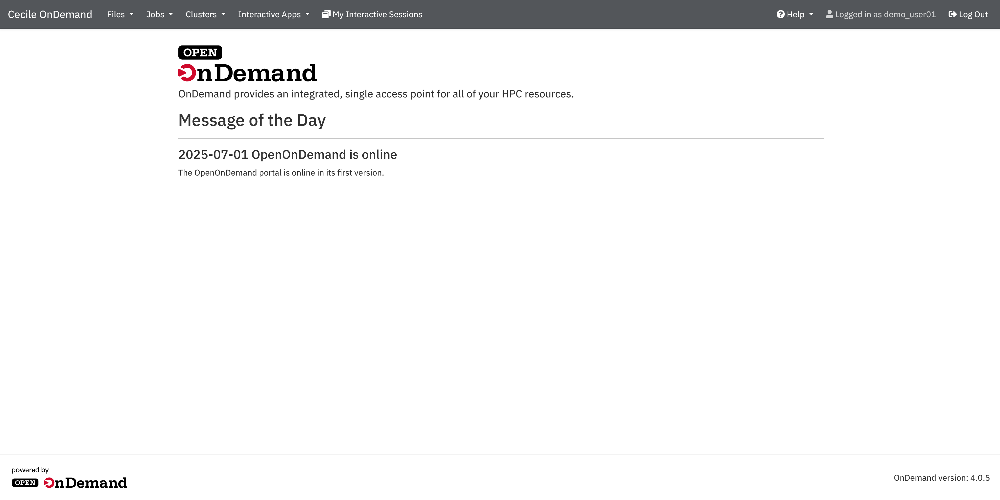
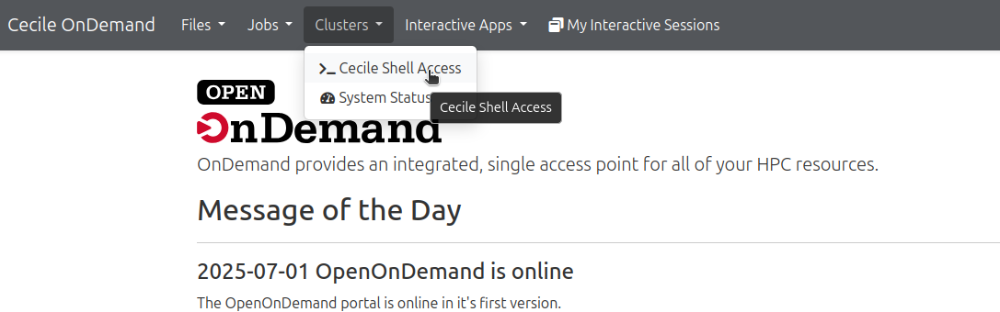
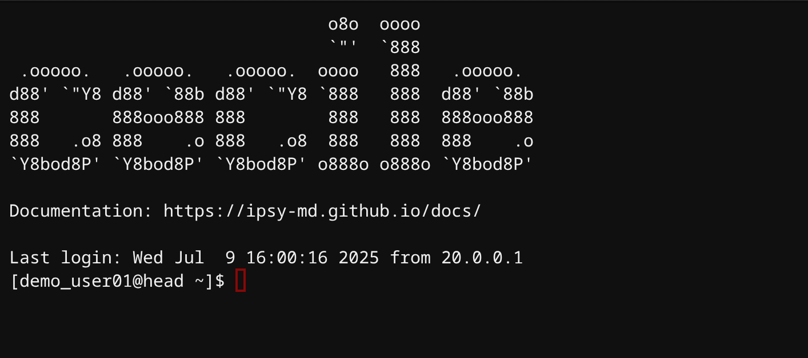

# Accessing Cecile

!!! Warning "Accessing Cecile outside the OvGU network"
    To access Cecile outside the OvGU network, you need do it via the OvGU [VPN](https://en.wikipedia.org/wiki/Virtual_private_network), please follow the URZ instructions in [here](https://www.urz.ovgu.de/en/vpn-path-204,616.html)

=== "Linux"

    ## Accessing Cecile from Linux

    Open a terminal in your machine, then type the following command making sure to insert your correct username

    ```bash
    ssh <username>@cecile.ovgu.de
    ```

    If you want to use any software with a Graphical User Interface (GUI) in Cecile (e.g. Matlab), please use the following command known as **X fowarding**. Keep in mind that this usage mode is very sensitive to latency, thus outside the OvGU network you will likely experience a poor performance in softwares with GUI.

    ```bash
    ssh -X <username>@cecile.ovgu.de
    ```

=== "macOS"

    ## Accessing Cecile from macOS

    Open a terminal in your machine, then type the following command making sure to insert your username

    ```bash
    ssh <username>@cecile.ovgu.de
    ```

    If you want to use any software with a Graphical User Interface (GUI) in Cecile (e.g. Matlab), you need to use the so-called **X fowarding**. Keep in mind that this usage mode is very sensitive to latency, thus outside the OvGU network you will likely experience a poor performance in softwares with GUI.

    !!! Warning "Issues with macOS"
        X fowarding does not currently work natively on macOS, in order to be able to use it follow the next steps:</b>
        1. Install [XQuartz](https://www.xquartz.org/)</b>
        2. By starting Xquartz a terminal should pop up, type the following command on the terminal:</b>
            ```bash
            ssh -X <username>@cecile.ovgu.de
            ```
        3. To test whether the X-forwarding is properly working, type `xclock` and press enter, if everything is working a clock should appear.

=== "Windows"

    ## Accessing Cecile from Windows

    **SSH option:**

    Windows 10 and 11 now include a built-in SSH client. To use it simply start a command prompt, type the following command and enter your password:

    ```
    ssh <username>@cecile.ovgu.de
    ```

    For further information about the SSH client, please take a look at the [official page](https://learn.microsoft.com/en-us/windows/terminal/tutorials/ssh)

    If you want to use any software with a Graphical User Interface (GUI) in Cecile (e.g. Matlab), you need to use the so-called **X fowarding**. Keep in mind that this usage mode is very sensitive to latency, thus outside the OvGU network you will likely experience a poor performance in softwares with GUI.

    !!! Warning "Issues with Windows"
        X fowarding does not currently work natively on Windows, in order to be able to use it, you need to follow the next steps:</b>
        1. Install [VcXsrv](https://github.com/marchaesen/vcxsrv), once installed it will be called `Xlaunch` on your machine.</b>
        2. Install the Windows Subsystem for Linux (WSL) by opening your power shall and typing the following command (see the next paragraph for more details):</b>
            ```bash
            wsl --install
            ```
        3. Launch `Xlaunch`, open the WSL terminal (you can find it in your windows menù) and type the following command:</b>
            ```bash
            ssh -X <username>@cecile.ovgu.de
            ```
        4. To test whether the X-forwarding is properly working, type `xclock` and press enter, if everything is working a clock should appear.

    **Windows Subsystem for Linux (WSL) option:**

    Starting from Windows 10 (version 2004), you can easily install in your Windows operating system a subsystem that let you run a distribution of Linux (Ubuntu as default, but you can also choose a different one).</b>
    WSL installation is very straightforward, you can find all the necessary information in the official [microsoft page](https://learn.microsoft.com/en-us/windows/wsl/install)

    Once you have installed the WSL on your pc, you can easily access Cecile via SSH as we explained above.

    Using a WSL provides multiple advantages: it allows you to use a Linux environment like Cecile, without giving up your Windows operating system. Interacting with Cecile via WSL facilitates many procedures, such as file transferring from and to Cecile. Files transferred via WSL will be directly available to your Windows system. Furthermore working with the command line will surely speed up all your processes, given that you will not need to go through additional tools to interact with Cecile.

=== "Web Browser (Open OnDemand)"

    ## Accessing Cecile via web browser (Open OnDemand)

    !!! warning "Access restrictions"
        In order to access Cecile via web browser, you must be connected either via ethernet cable into the OvGU network or you must to activate [eduVPN](https://www.urz.ovgu.de/en/vpn-path-204,616.html)

    !!! tip "Recommended browsers"
        Open OnDemand works regardless of your the operating system. However, to experience the best performance, we recommend you to use Chrome, alternatively Firefox or Edge (Safari is known to have some issues).

    Cecile can be accessed via web browser using a tool called [Open OnDemand](https://openondemand.org/). You simply need to type `ood.cecile.ovgu.de` on your browser address bar and press `enter`, alternatively you can press the button below.

    [Connect to Open OnDemand](https://ood.cecile.ovgu.de){ .md-button .md-button--primary .fontawesome-solid-paper-plane: }

    Once you provide your OvGU credentials you will be redirected to the Open OnDemand main page.

    <figure markdown="span">
        { width="900" }
        <figcaption></figcaption>
    </figure>

    In the Open onDemand main page you are presented with different options to interact with the cluster, such as shell access, file access and interactive jobs.

    The most direct way to interact with Cecile is to open a shell in your browser, as you see in the image below.

    <figure markdown="span">
        { width="900" }
        <figcaption></figcaption>
    </figure>

    By opening the shell in the browser you are redirected to your `home` on Cecile's head node. From now on, you can use Cecile as you would normally do it.

    <figure markdown="span">
        { width="900" }
        <figcaption></figcaption>
    </figure>

    !!! warning "Log out from Open OnDemand"
        Please, remember to log out from Open OnDemand in case you do not need it any more.
        You can log out by simply pressing the log out button. 

## Avoid passwords, use SSH keys


A more secure way to access Cecile is by using so called public key authentication instead of a canonical password.
In a nutshell, a criptographic algorithm creates for you a pair of keys: a **private key** and a **public key**, both of them will be stored in your machine. The private key must always be protected and not shared, while you will share the public key with the cluster administrator. See below how to set-up a pair of private/public keys.

=== "Linux/Mac"

    - Run the following command in your terminal. The key pair will be generated inside a hidden `.ssh` folder in a directory of your choice. You will be then asked to provide a **passphrase**, we strongly recommend you to set up a passphrase for further security.
    ```bash
    ssh-keygen -t ed25519
    ```

    - Check that your keys have been generated by typing within the directory that contains the `.ssh` folder:
    ```bash
    ls -l
    ```
    You should see a similar output listing both the private key `id_ed25519` and the public key `id_ed25519.pub`
    ```bash
    -rw------- 1 user  464 Jun 12 17:14 id_ed25519
    -rw-r--r-- 1 user  101 Jun 12 17:14 id_ed25519.pub
    ```

    - Now that you have the key pair, in case you do not have a password for the cluster you just need to provide the public key, `id_ed25519.pub` in this case, to your cluster administrator.
    - If you already have a password, you can simply access the folder `.ssh` on our local machine, type the following command, provide the password and your public key will be transferred to the cluster:
    ```bash
    ssh-copy-id <username>@cecile.ovgu.de
    ```
    - You can now simply type the following command to access the cluster. The first time you access the cluster, you will be asked to provide the passphrase one time only.
    ```bash
    ssh <username>@cecile.ovgu.de
    ```

=== "Windows"

    !!! note "Access with WSL"
        In case you use a WSL on your Windows system, you can directly refer to the Linux/Mac section to set up your SSH keys


    If you want to set up a public key authentication via a GUI, you can use [PUTTY](https://www.putty.org/), a straightforward explanation can be found in the [official microsoft page](https://learn.microsoft.com/en-us/viva/glint/setup/sftp-ssh-key-gen)

## Access from medical campus

The OVGU medical campus uses a separate VPN from the OVGU VPN. To be able to access from there a network activation is set up from the URZ which has to be prolonged once a year.

!!! Warning Known Issues
    The DNS name resolution for `cecile.ovgu.de` does not work from the medical campus. Workaround: use the IP address directly.
