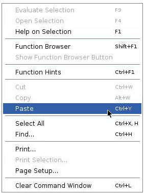
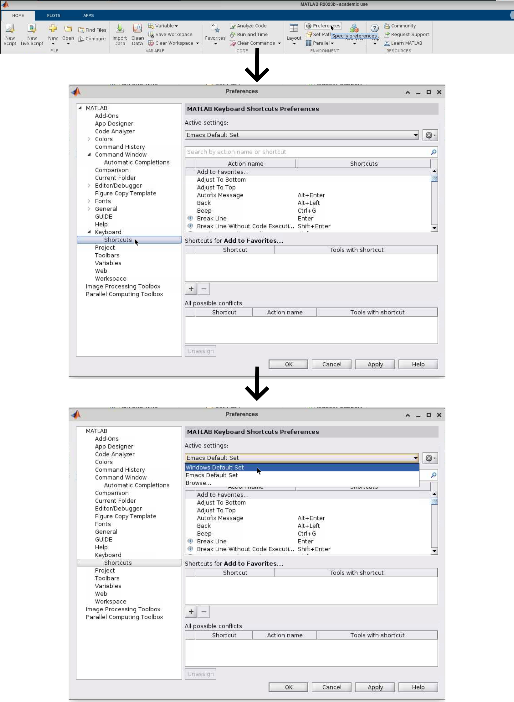
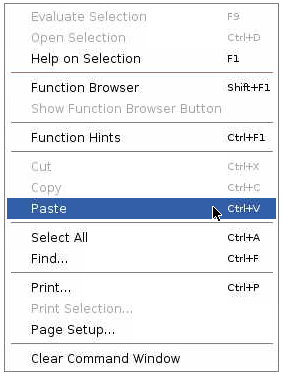

# Software stack

In Cecile softwares are provided systemwide through a so called **software stack**, a collection of softwares, which is generated using the [**Spack package manager**](https://spack.io/).

A software stack contains a number of softwares necessary for your analysis and many more. If any software you might need is missing from the stack you need to contact `cecile-admins-l at ovgu.de`.


## Type of stacks

Currently there are **two kinds of stacks** available:

1. **Current stack:** A stack that is kept stable throughout one semester. Each semester a new stable stack is created from scratch, while the old `current stacks` are still in place and can be used by specifying the the date in the following way: `current_<date>`.
2. **Experimental stack**: A flexible stack that is going to be frequently updated also upon user's request.

!!! Danger "Multiple software versions in Experimental stack"
    Continuous updating in the `experimental stack` can lead to have multiple versions of the same software (e.g. `python ~gcc@11.0` vs `python ~gcc@11.1`) in the `experimental stack`, therefore be careful to load the correct version when using the experimental stack. Usually back compatibility between software versions is mantained, but sometimes this might not be the case and some feature might have been changed.


!!! note "Why two different stacks"
    If you need to use a software that is not yet available on Cecile (in the `current stack`), after your request, the missing software is going to be installed in the `experimental stack`

## How to use the stacks

There are multiple ways to access the stack depending on the control you want over the versions of softwares you would like to use:

### Via modules

For every installed package spack generates a module file in addition, this allows you to use the `module` command to load specific software.
Unlike the environment method, this method is extremely fast and it allows you to specify the version of the software you prefere.

!!! note "Software names in the stack"
    Before loading a module it is advisable to check how the software you are interested in is named in the stack.
    For example all python software are preceded by `py-`, thus to load `pandas` you need to type: `module load py-pandas`.
    This naming convention is limited to stack, in your code software must have their usual names.

=== "Current stack"

    ```bash
    . /software/current/env.sh
    ```

    To see what packages are installed run
    ```bash
    module avail
    ```

    To load a package (in case a specific version is needed, load the version of the software shown by `module avail`)
    ```bash
    module load python
    ```


=== "Experimental stack"

    ```bash
    . /software/experimental/env.sh
    ```

    To see what packages are installed run
    ```bash
    module avail
    ```

    To load a package (in case a specific version is needed, load the version of the software shown by `module avail`)
    ```bash
    module load python
    ```

### Load the Ipsy environment

Instead of loading every package individually, you can activate an evironment containing only the newest version of each package.

!!! Warning "Loading environments takes time"
    Due to some changes in the package manager (Spack) currently loading an environment is a slow process that could take up to 5 minutes.

=== "Current stack"

    ```bash
    . /software/current/ipsy-env/activate
    ```

    Now that the stack has been loaded, you can start each single software.

    ```bash
    python
    ```

    In order to see which softwares are available in the environment type the following command:

    ```bash
    module avail
    ```

=== "Experimental stack"

    ```bash
    . /software/experimental/ipsy-env/activate
    ```

    Now that the stack has been loaded, you can start each single software.

    ```bash
    python
    ```

    In order to see which softwares are available in the environment type the following command:

    ```bash
    module avail
    ```

## Matlab software stack

The Matlab installation provided in the stack does include a variaty of toolboxes. In general we differentiate between toolboxes provided by MathWorks and third party toolboxes.

MathWorks toolboxes are toolboxes from <https://www.mathworks.com/products.html> like e.g. `Image Processing Toolbox` or `Statistics and Machine Learning Toolbox` and are included automatically.

Third party toolboxes like `SPM` or `FieldTrip` are also available in the central software stack but have to be loaded manually.

=== "Current stack"

    ```bash
    /software/current/matlab_toolboxes/
    ```

    e.g load `SPM` individually
    ```bash
    addpath /software/current/matlab_toolboxes/spm12
    ```

=== "Experimental stack"

    ```bash
    /software/experimental/matlab_toolboxes/
    ```

    e.g load `SPM` individually
    ```bash
    addpath /software/experimental/matlab_toolboxes/spm12
    ```

!!! Warning "Don't use `genpath` to load all thirsparty toolboxes at once"
    Although matlab provides the possibility to load all toolboxes within a path by using `genpath`, this is not recommended to do because some of the toolboxes don't work well together and might break. For example `spm` will not start anymore.

### Matlab shortcuts fix

While interacting with Matlab, you might notice that shortcuts such as **Ctrl-C** or **Ctrl-V** do not work as expected, this behavior is due to a different editor keys-shortcuts binding, in the image below you can see that **Paste** is indeed bound to the **Ctrl-Y** shortcut.

<figure markdown="span">
    { width="250" }
    <figcaption></figcaption>
</figure>

If you go to **preference**, then to **shortcuts** and select **Windows Default Set** and press **Apply**, the regular shortcuts will be repristinated.

<figure markdown="span">
    { width="900" }
    <figcaption></figcaption>
</figure>

To verify that the process was successful, do a right click with your mouse and you will see that now **Paste** is bound to the familiar **Ctrl-V**.

<figure markdown="span">
    { width="250" }
    <figcaption></figcaption>
</figure>