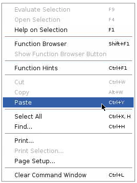
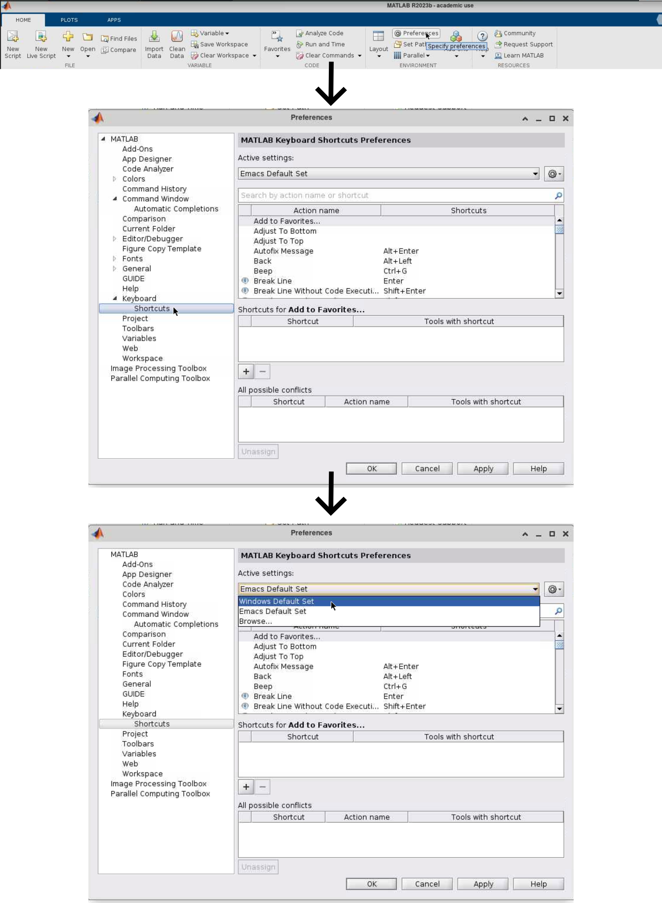
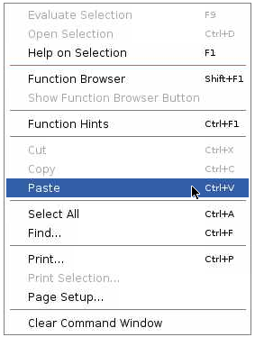
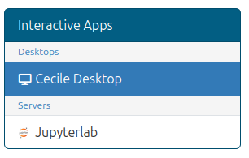
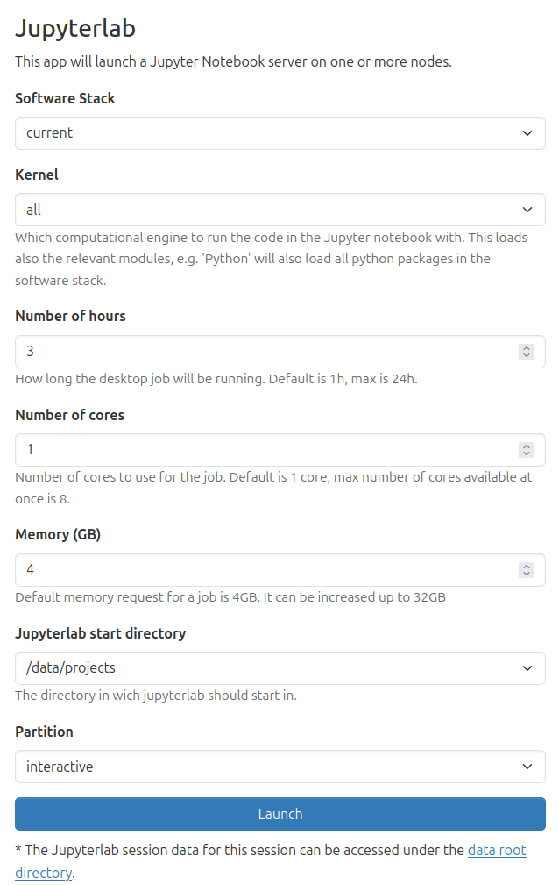
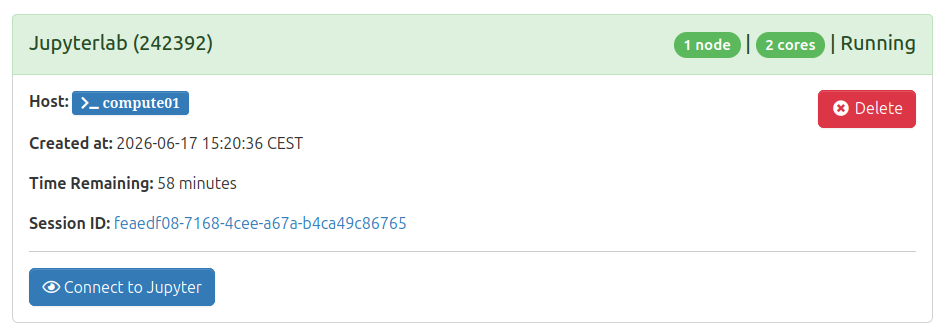
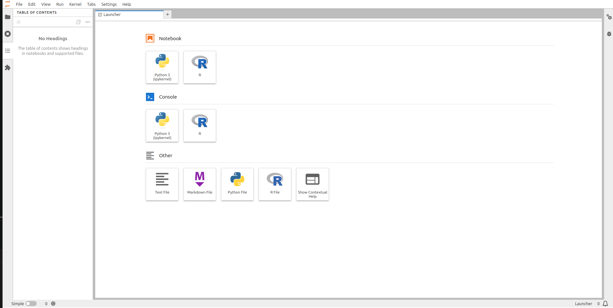
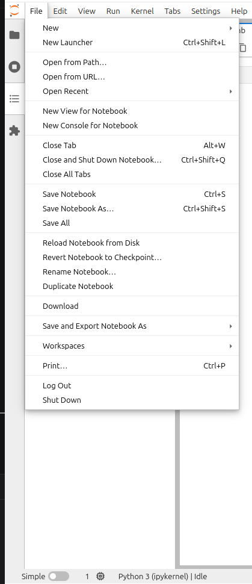

# Software stack

In Cecile software is provided systemwide through a so called **software stack**, a collection of software, generated by using the [**Spack package manager**](https://spack.io/).

A software stack contains a number of software necessary for your analysis and much more. If any software you need is missing from the stack you may contact `cecile-admins-l at ovgu.de` to request it.

## Type of stacks

There are **two kinds of stacks** available:

1. **Current stack:** A stack that is kept stable for a long period of time. A new stable stack is created periodically from scratch, which means that the new `current` stack will include only new up-to-date software versions; however the old versions of `current` stacks are still available on the cluster.
2. **Experimental stack**: A flexible stack that is going to be frequently updated also upon user's request. A software requested by a user will be added to the `experimental` stack; as soon as a new `current` stack is created the new software will be also added to `current`.

!!! Danger "Multiple software versions in `experimental` stack"
    Continuous updating in the `experimental stack` can lead to have multiple versions of the same software (e.g. `python ~gcc@11.0` vs `python ~gcc@11.1`) in the `experimental stack`, therefore be careful to load the correct version when using the experimental stack. Usually back compatibility between software versions is mantained, but sometimes this might not be the case and some feature might have been changed.

## How to use the stacks

=== "Current stack:"

    - Source the `current` stack, by running the following command (please, be aware of the space between the dot and the path)

        ```bash
        . /software/current/env.sh
        ```

    - Now load a software using `module load <software name>` 
        
        ```bash
        module load py-pandas
        ```
    - To see what software is available run the following command
        
        ```bash
        module avail
        ```

=== "Experimental stack"

    - Source the `experimental` stack, by running the following command (please, be aware of the space between the dot and the path)

        ```bash
        . /software/experimental/env.sh
        ```

    - Now load a software using `module load <software name>` (in case a specific version is needed, check the software version with `module avail`)
        ```bash
        module load py-pandas
        ```

    - To see what software is available run the following command

        ```bash
        module avail
        ```


!!! note "Software names in the stack"
    Before loading a module it is advisable to check how the software you are interested in is called in the stack.
    For example all python software is preceded by `py-`, thus to load `pandas` you need to type: `module load py-pandas` and
    `R` software is preceded by `r-`.
    This naming convention needs to be used when loading the software, in your code software must have their usual names.

## New and old versions of `current` stacks and how to use them

As pointed out, the `current` stack is updated and rebuilt periodically; this procedure ensures that the cluster always includes up-to-date versions of all software. However, the older versions of `current` stacks are still available on the cluster. To distinguish them from the up-to-date `current` stack, the older versions of `current` stacks get a suffix indicating the creation date, `current_<yyyy-mm-dd>`.

To use an older `current` stack you only need to source the correct stack:

```bash
. /software/current_<yyyy-mm-dd>/env.sh
```

For example:

```bash
. /software/current_2024-07-28/env.sh
```

!!! note "Medusa software stack"
    In case you need to use the old software stack used within the Medusa cluster, please contact the admin at `cecile-admins-l at ovgu.de`

### Available `current` stacks and included software

The following tables represent all the `current` stacks (up-to-date and older) currently available on the cluster and software included in each of them.

=== "`current`"
    | Software | Version |
    | --- | -- |
    | bids-validator | 2.4.1
    | bidsonym | 0.0.6_2025-10-24
    | connectome-workbench | 2.1.0
    | eyelink | 2.1.1197.0_v26.04
    | fmriprep | 25.2.5
    | freesurfer | 8.2.0-1
    | fsl | 6.0.7.22
    | gdb | 17.1
    | git-annex | 10.20230408
    | git | 2.53.0
    | gnuplot | 6.0.0
    | hdf5 | 1.14.6 |
    | headcase-pipeline | 1.0.0_2024-05-16_cca8bf2 |
    | heudiconv | 1.4.0 |
    | laynii | 2.10.0 |
    | matlab | r2025b |
    | mricron | 1.2.20211006 |
    | mriqc | 24.0.2 |
    | plantus | 0.1.1 |
    | py-bidscoin | 4.6.2 |
    | py-bidskit | 2025.11.7 |
    | py-datalad | 1.4.0 |
    | py-dcm2bids | 3.2.0 |
    | py-eye2bids | 0.1.2026-03.16 |
    | py-flake8 | 7.3.0 |
    | py-glmsingle | main |
    | py-jupyterlab | 4.5.8 |
    | py-matplotlib | 3.10.9 |
    | py-memory-profiler | 0.61.0 |
    | py-mne-bids | 0.18.0 |
    | py-mne | 1.11.0 |
    | py-mypy | 2.1.0 |
    | py-neurokit2 | 0.2.13 |
    | py-neurora | 1.1.6.12 |
    | py-nibabel | 5.4.2 |
    | py-nilearn | 0.13.1 |
    | py-nipype | 1.11.0 |
    | py-numba | 0.65.1 |
    | py-numpy | 2.3.5 |
    | py-palettable | 3.3.3 |
    | py-pandas | 2.3.3 |
    | py-pip | 26.1 |
    | py-pybv | 0.7.6 |
    | py-rsatoolbox | 0.2.0 |
    | py-scikit-learn | 1.8.0 |
    | py-scipy | 1.17.1 |
    | py-seaborn | 0.13.2 |
    | py-sphinx | 9.1.0 |
    | py-statsmodels | 0.14.6 |
    | py-virtualenv | 21.4.1 |
    | py-wesanderson | 0.0.4 |
    | python | 3.14.5 |
    | r-afex | 1.5-1 |
    | r-bayesfactor | 0.9.12-4.8 |
    | r-brms | 2.23.0 |
    | r-dplyr | 1.2.0 |
    | r-emmeans | 2.0.2 |
    | r-ggplot2 | 4.0.3 |
    | r-irkernel | 1.3.2 |
    | r-rstan | 2.32.7 |
    | r-tidyverse | 2.0.0 |
    | r | 4.5.3 |
    | simnibs | 4.6.0 |


=== "`current_2024-07-28`"

    | Software | Version |
    | --- | -- |
    | bids-validator | 1.14.6 |
    | bidsonym | 0.0.6 |
    | deepprep | 25.1.0 |
    | environment-modules | 5.4.0 |
    | eyelink | 2.1.1197.0 |
    | fmriprep | 21.0.2 |
    | fmriprep | 23.0.2 |
    | fmriprep | 24.0.0 |
    | freesurfer | 7.4.1 |
    | fsl | 6.0.7.4 |
    | gdb | 14.2 |
    | git-annex | 10.20230408 |
    | git | 2.45.2 |
    | gnuplot | 6.0.0 |
    | hdf5 | 1.14.3 |
    | headcase-pipeline | 1.0.0_2024-05-16_cca8bf2 |
    | heudiconv | 1.1.6 |
    | laynii | 2.7.0 |
    | matlab | r2023b |
    | mricron | 1.2.20211006 |
    | mriqc | 23.1.0 |
    | py-bidscoin | 4.1.1 |
    | py-bidskit | 2023.9.7 |
    | py-datalad-hirni | 0.0.8 |
    | py-datalad | 0.18.4 |
    | py-dcm2bids | 3.1.0 |
    | py-eye2bids | 0.1.dev1 |
    | py-flake8 | 6.1.0 |
    | py-glmsingle | main |
    | py-jupyterlab | 4.0.1 |
    | py-matplotlib | 3.9.0 |
    | py-memory-profiler | 0.61.0 |
    | py-mne-bids | 0.15.0 |
    | py-mne | 1.7.1 |
    | py-mypy | 1.8.0 |
    | py-neurokit2 | 0.2.4 |
    | py-neurora | 1.1.6.10 |
    | py-nilearn | 0.10.3 |
    | py-nipype | 1.8.6 |
    | py-numba | 0.58.1 |
    | py-numpy | 1.26.4 |
    | py-palettable | 3.3.3 |
    | py-pandas | 2.1.4 |
    | py-pip | 23.1.2 |
    | py-pybv | 0.7.5 |
    | py-rsatoolbox | 0.2.0 |
    | py-scikit-learn | 1.5.1 |
    | py-scipy | 1.14.0 |
    | py-seaborn | 0.13.2 |
    | py-sphinx | 7.4.5 |
    | py-statsmodels | 0.14.0 |
    | py-virtualenv | 20.24.5 |
    | py-wesanderson | 0.0.3 |
    | python | 3.11.9 |
    | r-afex | 1.3-0 |
    | r-brms | 2.19.0 |
    | r-emmeans | 1.8.5 |
    | r-rstan | 2.21.8 |
    | r-tidyverse | 2.0.0 |
    | r | 4.4.0 |
    | rabies | 0.5.0 |
    | simnibs | 4.5.0 |
    | texlive | 20220321 |


## Matlab software stack

The Matlab installation provided in the stack does include a variaty of toolboxes. In general we differentiate between toolboxes provided by MathWorks and third party toolboxes.

MathWorks toolboxes are toolboxes from <https://www.mathworks.com/products.html> like e.g. `Image Processing Toolbox` or `Statistics and Machine Learning Toolbox` and are included automatically.

Third party toolboxes like `SPM` or `FieldTrip` are also available in the central software stack but have to be loaded manually.

=== "Current stack"

    ```bash
    /software/current/matlab_toolboxes/
    ```

    e.g load `SPM` individually
    ```bash
    addpath /software/current/matlab_toolboxes/spm12
    ```

=== "Experimental stack"

    ```bash
    /software/experimental/matlab_toolboxes/
    ```

    e.g load `SPM` individually
    ```bash
    addpath /software/experimental/matlab_toolboxes/spm12
    ```

!!! Warning "Don't use `genpath` to load all thirsparty toolboxes at once"
    Although matlab provides the possibility to load all toolboxes within a path by using `genpath`, this is not recommended to do because some of the toolboxes don't work well together and might break. For example `spm` will not start anymore.

### Matlab shortcuts fix

While interacting with Matlab, you might notice that shortcuts such as **Ctrl-C** or **Ctrl-V** do not work as expected, this behavior is due to a different editor keys-shortcuts binding, in the image below you can see that **Paste** is indeed bound to the **Ctrl-Y** shortcut.

<figure markdown="span">
    { width="250" }
    <figcaption></figcaption>
</figure>

If you go to **preference**, then to **shortcuts** and select **Windows Default Set** and press **Apply**, the regular shortcuts will be repristinated.

<figure markdown="span">
    { width="900" }
    <figcaption></figcaption>
</figure>

To verify that the process was successful, do a right click with your mouse and you will see that now **Paste** is bound to the familiar **Ctrl-V**.

<figure markdown="span">
    { width="250" }
    <figcaption></figcaption>
</figure>

## JupyterLab

**What is JupyterLab?**

JupyterLab is a web-based interactive environment for notebooks and code. For in depth information, please visit [Jupyterlab page](https://jupyter.org/).

### How to use JupyterLab on Cecile

JupyterLab works only via Open OnDemand

1. Once you are on Open OnDemand, go to `Interactive Apps` and select **JupyterLab** (image below) and a configuration window will be shown.

    <figure markdown="span">
        { width="250" }
        <figcaption></figcaption>
    </figure>

2. Configure your JupyterLab session (see image below):

    - **Kernel:** It allows to choose the language you want to use inside JupyterLab. The available kernels are `python` and `R`, by selecting either one of these kernels you are able to use only the selected language within JupyterLab. By selecting `all` you have both `python` and `R` kernels and all the relative libraries available.

    - **Jupyterlab start directory:** There are two starting directory options: `user home`, which allows you to start and use JupyterLab in your `home`, and `/data/projects/` which allows you start JupyterLab in `/data/projects/` and to freely navigate to your project via the JupyterLab GUI. Keep in mind that if you select `user home` as starting directory, you cannot navigate to `/data/projects/` and vice versa.

    - The remaining configuration options are the same as any other interactive session.

    !!! Warning "Loading all libraries takes time"
        By selecting `all` in kernels, you have more flexibility inside JupyterLab, but it requires about 1 minute to load all the libraries. Please be patient.

    <figure markdown="span">
        { width="500" }
        <figcaption></figcaption>
    </figure>

3. Launch JupyterLab

    <figure markdown="span">
        { width="500" }
        <figcaption></figcaption>
    </figure>

4. Now you are on JupyterLab and you can work on notebooks or code.

    <figure markdown="span">
        { width="800" }
        <figcaption></figcaption>
    </figure>

5. Once you are done working with JupyterLab, please shut down the interactive session: `File` --> `Shut Down`

    <figure markdown="span">
        { width="250" }
        <figcaption></figcaption>
    </figure>
    

    