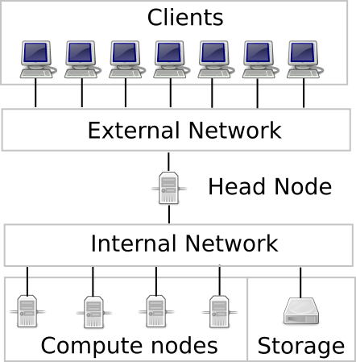

# Getting started

## What is a computational cluster?

A computational cluster is a collection of interconnected computers (see image below), called **compute nodes**, accessable and operable via a single computer called the **head node**. Each node offers a pool of resources such as CPUs, which in turn contain multiple cores, and volatile memory (RAM). The strength of a cluster comes from the collective interplay among resources which allows them to work as a unique entity able to perform computationally expensive parallel tasks (e.g. analyses, modelling etc.) otherwise difficult to achieve by a single computer. 

<figure markdown="span">
  { width="500" }
  <figcaption></figcaption>
</figure>

## Why should I use a cluster instead of my own computer?

- **Time**: A cluster allows you to perform computationally expensive tasks in a reduced amount of time with respect to your regular work computer.
  
- **Parallelization**: A typical cognitive neuroscience project requires the analysis of group of subjects, which can often take long time, by leveraging on the multiple resources, you can perform the analysis on multiple subjects virtually at the same time.
   
- **Security and backups**: A cluster ensures that your data are frequently backed up and protected, thus allowing also to store and analyze sensitive data (e.g. patient data).
  
- **Reproducible environment**: The software set-up guarantees a stable environment containing all the tools needed for your analyses that can be easily reproduced outside the cluster itself.

## What do you need to do to use the cluster?

- **An account:** You simply need an account, please contact `cecile-admins-l` at `ovgu.de` to obtain one.

- **Shell scripting:** If you prefer to work on the cluster via shell (the canonical way), but you have no experience with shell scripting, we recommend this straighforward [shell tutorial](https://swcarpentry.github.io/shell-novice/). You do not need to master it to use the cluster, but you can use the following list to start learning the basic concepts:
  
    -  Where you are and how to navigate through the folders: `pwd`, `cd`
    -  How to list content (folders/files): `ls` 
    -  How to create and remove folders/files: `mkdir`, `touch`, `rm`
    -  How to copy folders/files: `rsync`, `cp`
    -  How to move and rename folders/files: `mv`
    -  How permissions work and how to modify them: `chmod`
    -  How to write a simple shell script and execute it</b>  

- **An editor:** Choose the editor you prefer among the available ones: [**Nano**](https://www.nano-editor.org/) (the most user friendly), [**Vim**](https://www.vim.org/), [**Emacs**](https://www.gnu.org/software/emacs/).

## How to request a guest account

To obtain a guest account for Cecile it is necessary to obtain first a guest account at OvGU.

- Guest accounts can be requested by OvGU professors belonging to Ipsy to the URZ by writing an email to `it-service` at `ovgu.de` with the following information about the guest researcher:

    - First name
    - Last name
    - Date of birth
    - A private-mail address, in case the password has to be reset
    - Expiration date (Optional, max. 1 year)

- Once the OvGU guest account has been obtained, the professor needs to communicate the guest username to the cecile admin by email (to`cecile-admins-l` at `ovgu.de`). The cluster administrator will then set up a cecile account for the guest researcher.

## How to make a fair usage of the cluster

!!! Warning "The cluster is a small community"
    When you work on the cluster you share space and resources with other users, behave accordingly.

- Always remember that, once you access the cluster you are in the `head node` which is a shared space/resource. If you run a heavy computation you could either slow down or prevent others from doing regular activities on the cluster. 
- Use the `head node` as an entry point where you can run light tasks and if you need to run heavy computations, like fMRI analyses, use the job scheduler (e.g. **Slurm**).
- If you need to run computationally heavy tests/analyses in an interactive fashion, use **interactive jobs** in the scheduler. By doing so you will be assigned a specific resource and you will not interfere with any other users. 
- Always think before polluting a shared space like the `group` folder with your data or other unecessary files. Do not store data or analyses in `groups/<group_name>/`, `project` is the right place to store them.

## Clusters at Ipsy:

At ipsy we currently have two clusters: the new one, [Cecile], named after the **French neurologist Cécile Vogt**, and the old one, [Medusa], named after the **Greek mythological figure**.

[Cecile]: cecile/access
[Medusa]: medusa/access